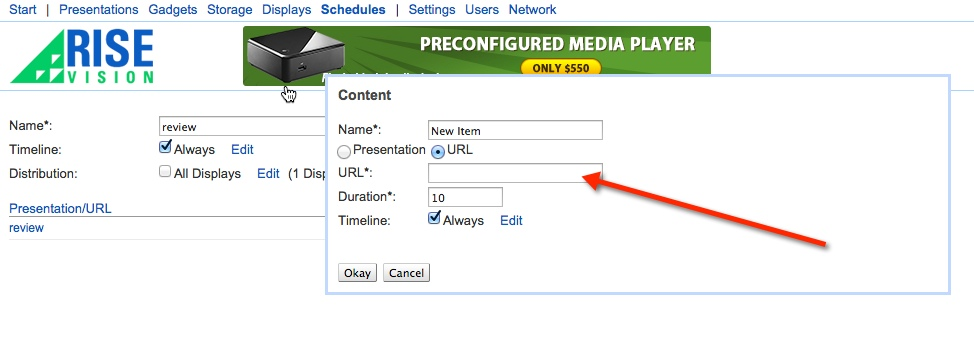

# Restaurant Promotion Template 

## Introduction

The Restaurant Promotion Template was created to display a series of high impact animated promotions that can be easily modified to accommodate your specific message. A preview of the template can be seen here: http://rise-vision.github.io/content-restaurant-promotion/index.html

##Steps to run the events template:##

1. Fork or download the entire content-templates repository.


2. Modify the files within the restaurant-promotion folder directory to fit your needs. (see below on how to modify specific elements)


3. Host the entire “restaurant-promotion” folder directory in rise vision storage or your web hosting service.


4. Copy the link to the index.html file where you have it hosted and insert the url into a schedule. (you can also add this link to the url gadget within a presentation)



##Directions to modify the restaurant promotion template:##

####Changing the background image
Open the style.css file and locate the following code for each of the 3 images. The background image can be changed by modifying the url information within the () following background-image to the path of your new logo:

``` .image-1 {
	width:100vw;
	height:100vh;
	position: absolute;
	top:0;
	left:0;
	background-image:url(images/background-1.jpg);```

####Changing the text transition
To change the duration of the transition, open the style.css file and locate the following code for each of the 3 images:
```-webkit-animation:image-1-animation 20s ease-out infinite;
	animation:image-1-animation 20s ease-out infinite;```

The length of the animation can be altered by changing the value in seconds (currently 30s) as can the style of transition (currently ease-out).

####Changing the image transition
To change the duration of the text transition (which should always match the image transition), open the style.css file and locate the following code for each of the 3 text blocks:
```-webkit-animation:text-1-animation 20s ease-out infinite;
	animation:text-1-animation 20s ease-out infinite;```

The length of the animation can be altered by changing the value in seconds (currently 30s) as can the style of transition (currently ease-out).

####Changing the logo
Open the style.css file and locate the following code. Modify the url information within the () to the path of your new logo:

```.logo {
	width:10vw;
	height:5vw;
	position: absolute;
	right:4vh;
	bottom:4vh;
	background-image:url(images/logo-onthego.png);```

## Built With
actual tools used
- HTML
- CSS3
- Google Web-Components


Restaurant Promotion Template works in conjunction with [Rise Vision](http://www.risevision.com), the [digital signage management application](http://rva.risevision.com/) that runs on [Google Cloud](https://cloud.google.com).

At this time Chrome is the only browser that this project and Rise Vision supports.

## Submitting Issues
If you encounter problems or find defects we really want to hear about them. If you could take the time to add them as issues to this Repository it would be most appreciated. Please Identify the specific template that has the issue and follow the following format where applicable:

**Reproduction Steps**

1. did this
2. then that
3. followed by this (screenshots / video captures always help)

**Expected Results**

What you expected to happen.

**Actual Results**

What actually happened. (screenshots / video captures always help)

## Contributing
All contributions are greatly appreciated and welcome! If you would first like to sound out your contribution ideas please post your thoughts to our [community](http://community.risevision.com), otherwise submit a pull request and we will do our best to incorporate it.

### Suggested Contributions
- Alternative ways to animate background
- Alternative ways to animate text transitions
- Dynamically update events from custom data source
- i18n Language Support


## Resources
If you have any questions or problems please don't hesitate to join our lively and responsive community at http://community.risevision.com.

If you are looking for user documentation on Rise Vision please see http://www.risevision.com/help/users/

If you would like more information on developing applications for Rise Vision please visit http://www.risevision.com/help/developers/.

 If you have any questions or problems please don't hesitate to join our lively and responsive community at http://community.risevision.com.
 
**Additional Content Templates can be found here: https://github.com/Rise-Vision/content-templates**

**Facilitator**

[Mathew Meiers](https://github.com/mmeiers "Mathew Meiers")
